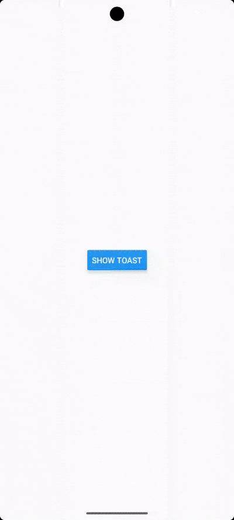

# 🔔 react-native-toast-kit

A customizable and lightweight toast/snackbar notification library for React Native apps.

> Show beautiful toast messages with support for themes, icons, actions, animations, and more.

---

## 🎞 Demo

## ✨ Features

- ⚡ **Lightweight & Fast** — Optimized toast/snackbar notifications for React Native apps.
- 🎨 **Customizable UI** — Fully customizable colors, icons, text styles, spacing, and more.
- 🔁 **Slide Animations** — Choose slide-in directions: left, right, or none.
- 🧭 **Positioning Options** — Display toasts at `top`, `bottom`, or `center` of the screen.
- ⏱ **Auto Dismiss Support** — Configure duration and auto-hide behavior easily.
- ❌ **Manual Dismiss Option** — Includes a dismiss button if `autoDismiss` is disabled.
- 🔧 **Developer-Friendly Props** — Flexible prop types with TypeScript support.
- ✅ **Icon Integration** — Supports custom or predefined icons for each toast type.
- 📱 **Built for React Native** — Works seamlessly with `react-native` and `react-native-vector-icons`.

## 📦 Installation

    npm install react-native-toast-kit
    # or
    yarn add react-native-toast-kit

## Usage

    import React, { useState } from 'react';
    import { View, Button, StyleSheet } from 'react-native';
    import {Toast} from 'react-native-toast-kit';
    import type { ToastProps } from 'react-native-toast-kit';

    const App = () => {
    const [showToast, setShowToast] = useState(false);

    const toastProps: ToastProps = {
        message: 'This is a custom toast!',
        subMessage: 'This is some extra detail.',
        type: 'success',
        position: 'top',
        slideDirection: 'none',
        autoDismiss: true,
        duration: 300,
        onClose: () => setShowToast(false),
        iconPosition: 'start',
    };

    return (
        <View style={styles.container}>
        <Button title="Show Toast" onPress={() => setShowToast(true)} />
        {showToast && <Toast {...toastProps} />}
        </View>
    );
    };

    export default App;

    const styles = StyleSheet.create({
    container: {
        flex: 1,
        justifyContent: 'center',
        alignItems: 'center',
    },
    });

## 🛠 Props

| Prop               | Type                                           | Description                                 |
|--------------------|------------------------------------------------|---------------------------------------------|
| `message`          | `string`                                       | Main toast message                          |
| `subMessage`       | `string`                                       | Optional subtext below the main message     |
| `type`             | `'success'` \| `'error'` \| `'info'` \| `'warning'` | Predefined toaststyles                 |
| `icon`             | `ReactNode`                                    | Custom icon element                         |
| `iconPosition`     | `'start'` \| `'end'` \| `'center'`             | Alignment of the icon                       |
| `iconSpacing`      | `number`                                       | Spacing between icon and text               |
| `msgColor`         | `string`                                       | Text color for the main message             |
| `msgStyle`         | `TextStyle`                                    | Style for the main message                  |
| `subMsgColor`      | `string`                                       | Text color for the sub-message              |
| `subMsgStyle`      | `TextStyle`                                    | Style for the sub-message                   |
| `bgColor`          | `string`                                       | Background color of the toast               |
| `borderColor`      | `string`                                       | Border color of the toast                   |
| `borderWidth`      | `number`                                       | Border width of the toast                   |
| `borderRadius`     | `number`                                       | Border radius of the toast                  |
| `position`         | `'top'` \| `'bottom'` \| `'center'`            | Toast position on screen                    |
| `slideDirection`   | `'left'` \| `'right'` \| `'none'`              | Slide-in animation direction                |
| `autoDismiss`      | `boolean`                                      | Auto-hide toast after duration              |
| `duration`         | `number`                                       | Duration (ms) before auto-dismiss           |
| `onClose`          | `() => void`                                   | Callback when toast closes                  |
| `customToast`      | `'reactNode`                                   | Your own custom toast component             |

## License
This project is licensed under the MIT License - see the LICENSE file for details.